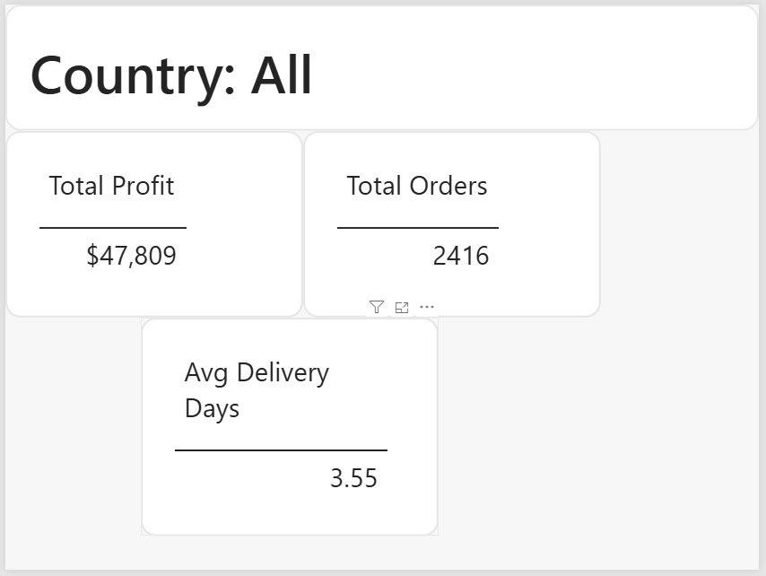

# 🚚 Supply Chain Analytics Dashboard – FY 2026


## 📌 Project Overview

This project analyzes global supply chain operations using SQL and Power BI to uncover business insights related to sales, profitability, delivery performance, customer segments, shipping methods, and regional performance.

The dashboard is designed to help businesses monitor operational efficiency and support data-driven decision-making.

---

## 🎯 Business Objectives

- Analyze sales and profit across countries and regions
- Monitor delivery performance and shipping efficiency
- Identify high-value customer segments
- Evaluate shipping methods
- Track yearly order trends
- Build an interactive business intelligence dashboard

---

## 🛠 Tools & Technologies

- Microsoft Excel
- MySQL
- Power BI Desktop
- SQL
- GitHub

---

## 📂 Project Workflow

Data Collection

↓

Data Cleaning (Excel)

↓

Data Import (MySQL)

↓

SQL Analysis

↓

Power BI Dashboard

↓

Business Insights

---

## 📊 Dashboard KPIs

- 📦 Total Orders
- 💰 Total Sales
- 📈 Total Profit
- 🚚 Average Delivery Time

---

## 📈 Dashboard Visualizations

- Order Trend Over Time
- Top Countries by Profit
- Sales Distribution by Region
- Orders by Shipping Method
- Delivery Status Distribution
- Orders by Customer Segment

---

## 🎛 Dashboard Filters

- Country
- Region
- Shipping Mode
- Customer Segment
- Year

---

## 📌 SQL Analysis

Key SQL queries performed include:

- Sales by Region
- Profit by Country
- Customer Segment Analysis
- Shipping Mode Analysis
- Delivery Status Analysis
- Yearly Order Trends
- Top Performing Countries

---

## 💡 Key Business Insights

- Western Europe generated the highest sales.
- The United States recorded the highest overall profit.
- Standard Class shipping accounted for most orders.
- Consumer customers placed the highest number of orders.
- More than half of the deliveries experienced delays, highlighting an opportunity to improve logistics performance.

---

## 📸 Dashboard Preview

### Main Dashboard


### Tooltip Page



## 📁 Repository Structure

```text
Supply-Chain-Analytics
│
├── Dataset
│   └── supply_chain_final_data.csv
│
├── SQL
│   └── SupplyChain_SQL_Queries.sql
│
├── PowerBI
│   └── SupplyChain_Dashboard.pbix
│
├── Screenshots
│   ├── Dashboard.png
│   └── Tooltip.png
│
├── README.md
└── LICENSE
```

# 📁 Project Files

| File | Description |
|------|-------------|
| [Dataset](Dataset/supply_chain_final_data.csv) | Cleaned Supply Chain Dataset |
| [SQL Script](SQL/SupplyChain_SQL_Queries.sql) | SQL Queries & Business Analysis |
| [Power BI Dashboard](PowerBI/SupplyChain_Dashboard.pbix) | Interactive Dashboard |
| [Dashboard Screenshot](Screenshots/Dashboard.png) | Main Dashboard |
| [Tooltip Screenshot](Screenshots/Tooltip.png) | Tooltip Page |

---

## ⬇️ Download Project Files

| Resource | Download |
|----------|----------|
| 📂 Dataset | [Download CSV](Dataset/supply_chain_final_data.csv) |
| 🗄 SQL Script | [Download SQL](SQL/SupplyChain_SQL_Queries.sql) |
| 📊 Power BI Dashboard | [Download PBIX](PowerBI/SupplyChain_Dashboard.pbix) |

---

## 🚀 Skills Demonstrated

- Data Cleaning
- SQL Query Writing
- Business Intelligence
- Dashboard Design
- KPI Development
- Data Visualization
- Data Storytelling
- Supply Chain Analytics

---

## 🔗 Quick Access

📊 [Power BI Dashboard](PowerBI/SupplyChain_Dashboard.pbix)

🗄 [SQL Queries](SQL/SupplyChain_SQL_Queries.sql)

📂 [Dataset](Dataset/supply_chain_final_data.csv)

## 👩‍💻 Author

**Naga Lakshmi Devanaboina**

M.Sc Biotechnology | Data Analytics Enthusiast

Skills:

- SQL
- Power BI
- Excel
- Tableau
- MySQL

---

⭐ If you found this project useful, consider giving it a Star!
